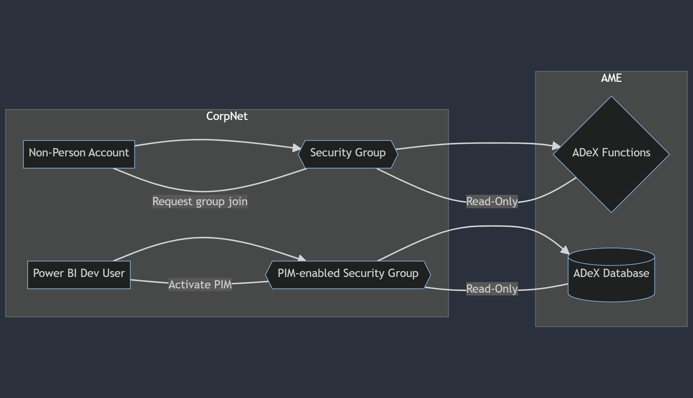

# Azure CXP PMO Unified Data Platform Power BI Developer & Non-Person Account Access
This document provides a guide for Power BI developers on how to obtain access to the Azure CXP PMO Unified Data Platform (UDP). It also includes instructions on how to obtain access for a Non-Person Account (NPA)

- [Azure CXP PMO Unified Data Platform Power BI Developer \& Non-Person Account Access](#azure-cxp-pmo-unified-data-platform-power-bi-developer--non-person-account-access)
  - [Access Overview](#access-overview)
    - [Non-Person Account (NPA)](#non-person-account-npa)
      - [NPA Access to UDP](#npa-access-to-udp)
      - [Power BI Developer Access](#power-bi-developer-access)
  - [Cluster Endpoints](#cluster-endpoints)
    - [Pre-Production](#pre-production)
    - [Production](#production)

## Access Overview

### Non-Person Account (NPA)
A Non-Person Account (NPA) - also known as service account - is for when access is needed, typically for automated tasks. Since these accounts aren’t tied to a specific individual, they’re ideal for jobs that run regardless of user presence.

> NOTE:
> Distinct Non-Person Accounts (NPAs) are required for both Production and Pre-Production environments.

#### NPA Access to UDP
Steps for access for a NPA

1. Navigate to [IDWeb](https://idweb.microsoft.com/IdentityManagement/default.aspx) - corporate network access required
2. Choose the appropriate group for your non-person account
   1. **Pre-Production** - [AzCXPPMO - ADEX - NPA - PPE](https://idweb.microsoft.com/IdentityManagement/aspx/common/GlobalSearchResult.aspx?searchtype=e0c132db-08d8-4258-8bce-561687a8a51e&content=AzCXPPMO%20-%20ADEX%20-%20NPA%20-%20PPE)
   2. **Production** - [AzCXPPMO - ADEX - NPA - PRD](https://idweb.microsoft.com/IdentityManagement/aspx/common/GlobalSearchResult.aspx?searchtype=e0c132db-08d8-4258-8bce-561687a8a51e&content=AzCXPPMO%20-%20ADEX%20-%20NPA%20-%20PRD)
3. Click on **Members** and then in the **Members To Add** box, type/search the name of your NPA and click the *validate and resolve* icon.
4. Click **OK**

Your request will be reviewed by the PMO Data Platform team.  You may be asked to provide additional information and/or a business justification

#### Power BI Developer Access
Gaining access to the cluster for Power BI developers involves a series of steps. These steps are designed for a device joined to CorpNet and should be executed in the sequence provided

1. Ensure you are connected to **MSFT-AzVPN-Manual**
2. Activate PIM access [here](https://ms.portal.azure.com/#view/Microsoft_Azure_PIMCommon/ResourceMenuBlade/~/MyActions/resourceId/dc9c6ebd-7f8d-48b2-a7a3-8a59fa4ccf26/resourceType/Security/provider/aadgroup/resourceDisplayName/Azure%20CXP%20PMO%20-%20ADEX%20-%20Developer%20JIT/resourceExternalId/dc9c6ebd-7f8d-48b2-a7a3-8a59fa4ccf26)
3. Once PIM has been activated, you can confirm access is working by clicking [here](https://azcxppmo-udp-adex-ppe.westus3.kusto.windows.net/)
4. Develop dashboard according to specification

> NOTE
> For specific steps on Power BI authoring and dataset refresh, please review the appropriate document [here]()

## Cluster Endpoints

### Pre-Production
https://azcxppmo-udp-adex-ppe.westus3.kusto.windows.net/

### Production
https://azcxppmo-udp-adex-prd.westus3.kusto.windows.net/